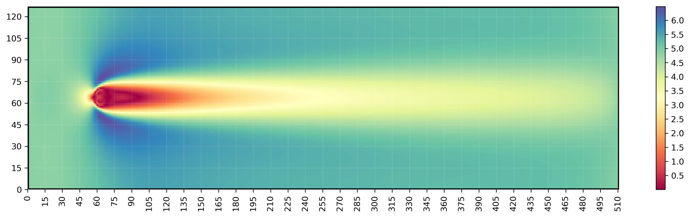

# **BOLT:** Lattice Boltzmann Simulator

<p align='center'>

</p>

### **Compilation Instructions:**
From within the ```BOLT``` directory, compile with: ```make```
<br>
The ```BOLT``` directory can be cleaned using: ```make clean```

**Run the Simulator:** ```./BOLT```

### **Altering Parameters:**
The majority of user-defined variables are stored in: ```BOLT/include/input.h``` - upon altering any parameter the code needs to be recompiled before running to ensure changes are reflected in the output.

### **Docker Usage:**

Build the image: ```docker build -t <image_name>:<tag> .```
<br>
Run the image: ```docker run -ti --rm --name <name> <image_name>:<tag>```
